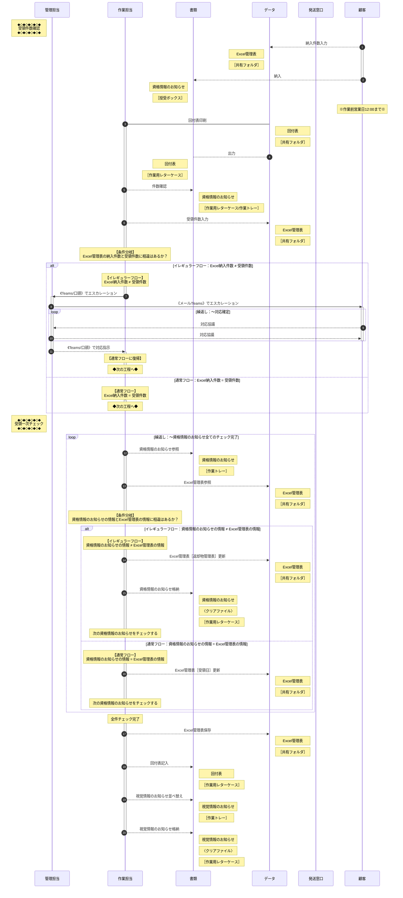

```mermaid
sequenceDiagram
    autonumber
    participant 管理担当
    participant 作業担当
    participant 書類
    participant データ
    participant 発送窓口
    participant 顧客

    Note left of 管理担当: ◆◇◆◇◆◇◆◇◆<br>受領件数確認<br>◆◇◆◇◆◇◆◇◆

    顧客 -->> データ: 納入件数入力
    activate 顧客
    Note left of データ: Excel管理表
    Note left of データ: ［共有フォルダ］

    顧客 -->> 書類: 納入
    deactivate 顧客
    Note left of 書類: 資格情報のお知らせ
    Note left of 書類: ［授受ボックス］

    note over 顧客: ※作業前営業日12:00まで※

    作業担当 -> データ: 回付表印刷
    activate 作業担当
    Note right of データ: 回付表
    Note right of データ: ［共有フォルダ］

    データ --> 書類: 出力
    Note left of 書類: 回付表
    Note left of 書類: ［作業用レターケース］

    作業担当 -->> 書類: 件数確認
    Note right of 書類: 資格情報のお知らせ
    Note right of 書類: ［作業用レターケース/作業トレー］

    作業担当 -->> データ: 受領件数入力
    Note right of データ: Excel管理表
    Note right of データ: ［共有フォルダ］

    note over 作業担当: 【条件分岐】<br>Excel管理表の納入件数と受領件数に相違はあるか？
    deactivate 作業担当

    alt イレギュラーフロー：Excel納入件数 ≠ 受領件数
        note over 作業担当: 【イレギュラーフロー】<br>Excel納入件数 ≠ 受領件数
        activate 作業担当

        作業担当 ->> 管理担当: 《Teams/口頭》でエスカレーション
        deactivate 作業担当
        activate 管理担当

        管理担当 ->> 顧客: 《メール/Teams》でエスカレーション
        activate 顧客

        loop 繰返し：～対応確定
            顧客 -->> 管理担当: 対応協議
            管理担当 -->> 顧客: 対応協議
        end
        deactivate 顧客

        管理担当 -->> 作業担当: 《Teams/口頭》で対応指示
        deactivate 管理担当
        activate 作業担当

        note over 作業担当: 【通常フローに復帰】
        note over 作業担当: ◆次の工程へ◆
        deactivate 作業担当

    else 通常フロー：Excel納入件数 = 受領件数
        note over 作業担当: 【通常フロー】<br>Excel納入件数 = 受領件数
        activate 作業担当
        
        note over 作業担当: ◆次の工程へ◆
        deactivate 作業担当
    end

    Note left of 管理担当: ◆◇◆◇◆◇◆◇◆<br>受領一次チェック<br>◆◇◆◇◆◇◆◇◆

    loop 繰返し：～資格情報のお知らせ全てのチェック完了
        作業担当 -->> 書類: 資格情報のお知らせ参照
        activate 作業担当
        Note right of 書類: 資格情報のお知らせ
        Note right of 書類: ［作業トレー］

        作業担当 -->> データ: Excel管理表参照
        Note right of データ: Excel管理表
        Note right of データ: ［共有フォルダ］

        note over 作業担当: 【条件分岐】<br>資格情報のお知らせの情報とExcel管理表の情報に相違はあるか？
        deactivate 作業担当

        alt イレギュラーフロー：資格情報のお知らせの情報 ≠ Excel管理表の情報
            note over 作業担当: 【イレギュラーフロー】<br>資格情報のお知らせの情報 ≠ Excel管理表の情報
            activate 作業担当

            作業担当 -->> データ: Excel管理表［返却物管理表］更新
            Note right of データ: Excel管理表
            Note right of データ: ［共有フォルダ］

            作業担当 -->> 書類: 資格情報のお知らせ格納
            
            Note right of 書類: 資格情報のお知らせ
            Note right of 書類: 〈クリアファイル〉
            Note right of 書類: ［作業用レターケース］

            note over 作業担当: 次の資格情報のお知らせをチェックする
            deactivate 作業担当

        else 通常フロー：資格情報のお知らせの情報 = Excel管理表の情報
            note over 作業担当: 【通常フロー】<br>資格情報のお知らせの情報 = Excel管理表の情報
            activate 作業担当

            作業担当 -->> データ: Excel管理表［受領日］更新
            Note right of データ: Excel管理表
            Note right of データ: ［共有フォルダ］

            note over 作業担当: 次の資格情報のお知らせをチェックする
            deactivate 作業担当
        end
    end

    note over 作業担当: 全件チェック完了
    activate 作業担当

    作業担当 -->> データ: Excel管理表保存
    Note right of データ: Excel管理表
    Note right of データ: ［共有フォルダ］

    作業担当 -->> 書類: 回付表記入
    Note right of 書類: 回付表
    Note right of 書類: ［作業用レターケース］

    作業担当 -->> 書類: 視覚情報のお知らせ並べ替え
    Note right of 書類: 視覚情報のお知らせ
    Note right of 書類: ［作業トレー］

    作業担当 -->> 書類: 視覚情報のお知らせ格納
    deactivate 作業担当
    Note right of 書類: 視覚情報のお知らせ
    Note right of 書類: 〈クリアファイル〉
    Note right of 書類: ［作業用レターケース］

```